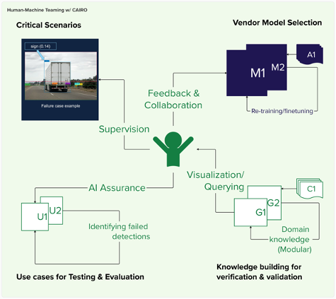
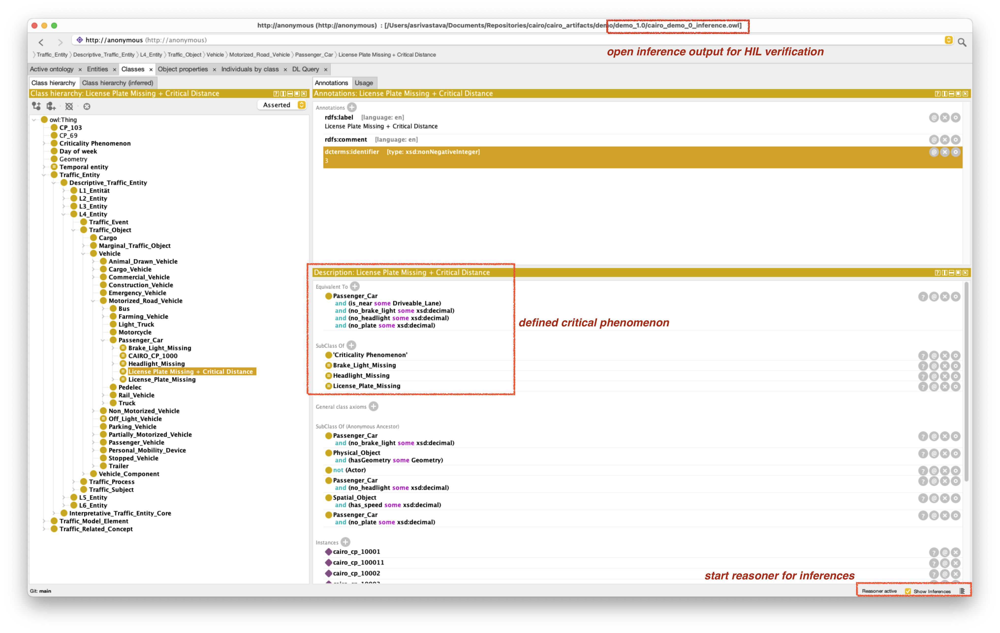
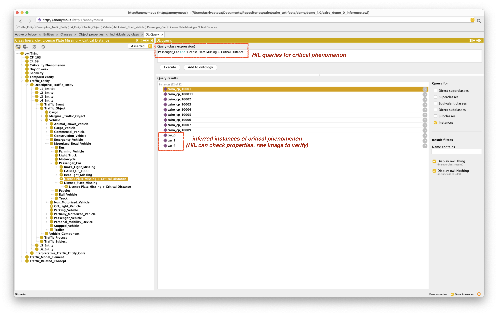

# CAIRO_artifacts

## Overview

This repository contains artifacts for the public release of CAIRO, built to detect + explain failure cases in the Operating Design Domain (ODD) of Autonomous Driving Systems (ADS). 

1. [Contents](#structure)
2. [Use Cases](#usecase)
3. [Dependencies](#dependencies)
4. [Notes](#design)

Using context-aware ontologies, CAIRO helps verify + validate ADS perception, and augments these graphs to identify risk or failure conditions in Object and Event Detection and Response (OEDR) applications.

    
# Structure & Contents 
The primary contents are as follow; there is additional documentation in `examples/` with scenario-specific details.

- `cairo-artifacts/` 
    - `cairo_auto/` - *ontology: traffic world / critical phenomena, documentation*
    - `examples/` - *demonstrated applications of CAIRO on real-world scenes*
        - *raw images: original scenario*
        - `inference_*.owl` - *reasoner-augmented graphs with added rules, CPs*
    - `figures/` - *explanatory graphics*
    - `tables/` - *explanatory tables highlighting examples of behavioral CPs and construction of SWRL queries*

  
# Use Cases 
The framework __empowers the Human-in-the-Loop (HITL)__.  

The HITL may modify the output knowledge graphs manually and run them against the Python-based reasoner tool. Alternatively, they may open them in the convenient and interpretable tool Protege (shown below). In either case, the CAIRO framework helps to perform integrity checks on physical properties of objects in the scene and alerts to any critical phenomena, __which the HITL can modify or verify__.

  
# Querying 
Once the ontology graph captures the required core and dependent concepts to represent real-world scenes consistently using common terminologies, the formalization allows curating complex behaviors, as shown below, for identifying CPs. This makes it possible to effectively differentiate scenes.

Below are examples of CPs using natural language and corresponding Semantic Query-Enhanced Web Rule Language (SQWRL) queries, focusing on key properties such as dynamic object properties, distance metrics, and behavioral unpredictability, and temporal relations. They address various criticalitis. You can use tools like Protege to query ontologies.

  
# Dependencies 

The following are the major external components of the framework. Some components themselves have required sub-packages and installation steps.

| Dependency | Type | Use |
| ---------- | ---- | --- |
| [Protege](https://protege.stanford.edu/download/protege/4.3/installanywhere/Web_Installers/) | Software | Knowledge Graph GUI |
| [Criticality-Recognition](https://github.com/lu-w/criticality-recognition) | GitHub Repository | Inferring Critical Phenomena | 
| [PyAUTO](https://github.com/lu-w/pyauto/tree/main) | GitHub Repository | Loading Traffic Ontologies |

###  Using Protege

Protege is a software that provides a GUI interface for manipulating, reasoning on, and querying ontologies. 

1. It can be downloaded from [its website](https://protege.stanford.edu/), or a newer web-based version may also be used. 
2. Protege supports some default reasoners (select via `Reasoner -> ELK` or `Reasoner -> HermiT`), but others such as the Pellet reasoner can also be used. 
3. One way to include non-native reasoners such as Pellet, is to locate a JAR file for that reasoner (JAR file [here](https://github.com/Complexible/pellet/raw/master/protege/plugin/com.clarkparsia.protege.plugin.pellet.jar) and Pellet repository [here](https://github.com/stardog-union/pellet)).
4. Then move this file into the Plugins directory of the Protege folder on the local machine, and load the reasoner as above.
5. To open an OWL file to test SWRL queries, select `File -> Open -> ...` and locate relevant files.
6. Queries can be tested by navigating to _e.g._, the `DL Query` tab and entering query syntax.

  
# Notes 

### Selecting Reasoners 

CAIRO primarily uses Pellet, although some HITL evaluation in Protege may have used the computationally efficient ELK. Both are open-source, and Pellet is compatible with CAIRO dependencies and has desirable capabilities:
- consistency checking (*are there contradictory facts?*)
- satisfiability checking (*are instances of a class possible?*)
- fully identifying types, sub-class relationships for all individuals/classes

### Detectors

For now, the framework uses an internal CAIRO object detection / segmentation system, but this is intended to be substituted with any vendor model. 

## Notice

The MITRE Corporation.

Approved for Public Release; Distribution Unlimited. Case Number 25-0079.
